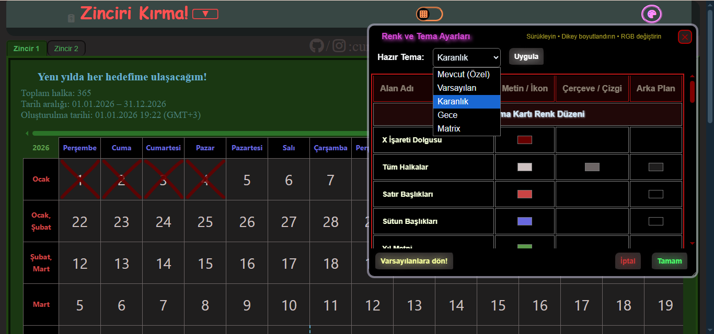
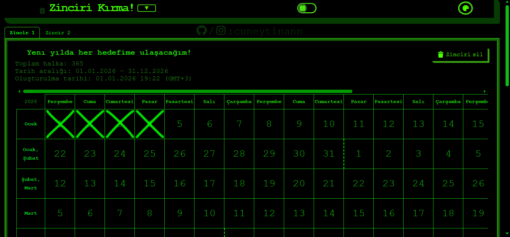
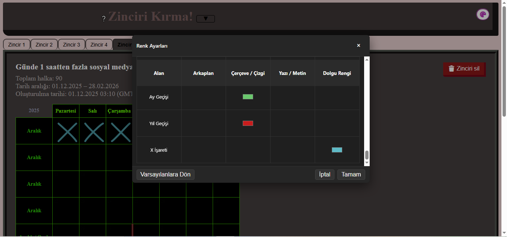
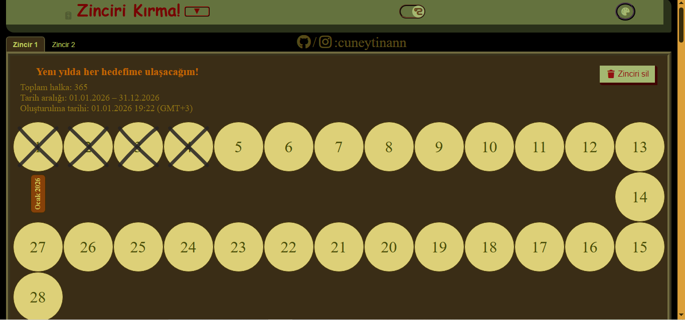
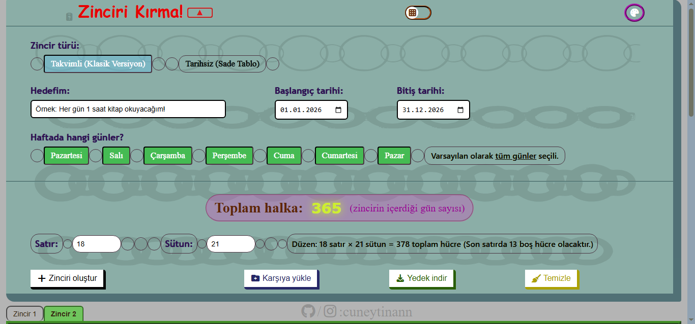
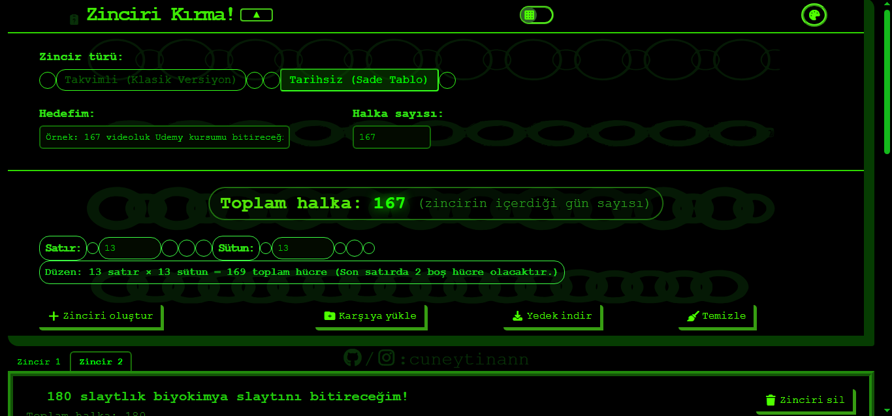
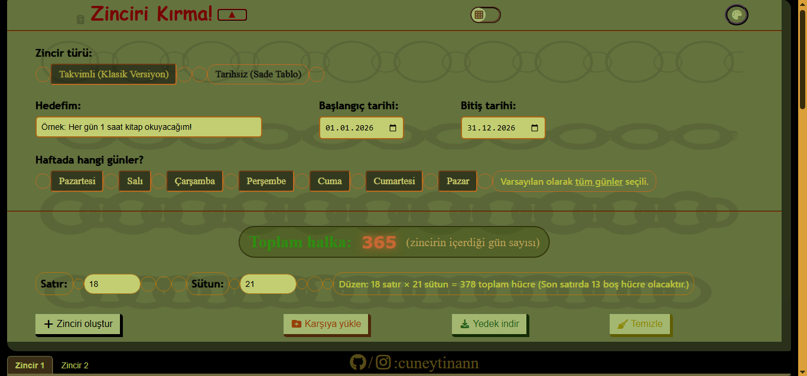
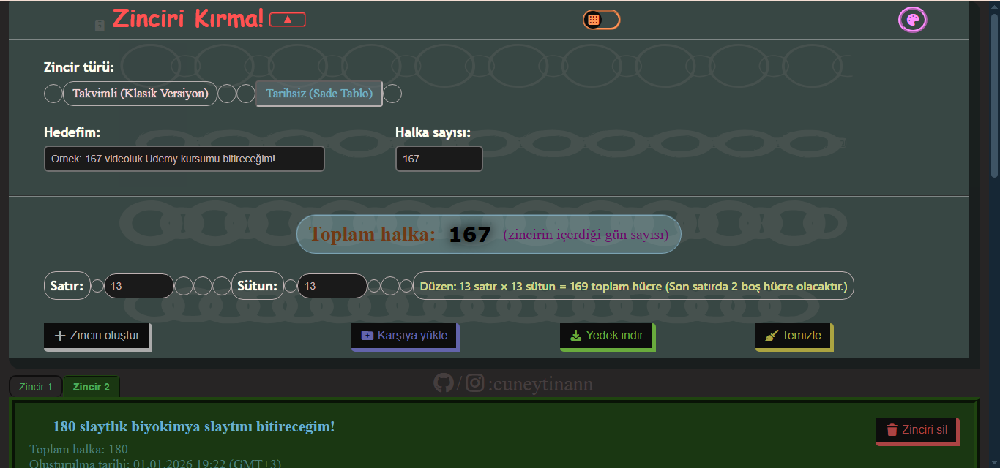
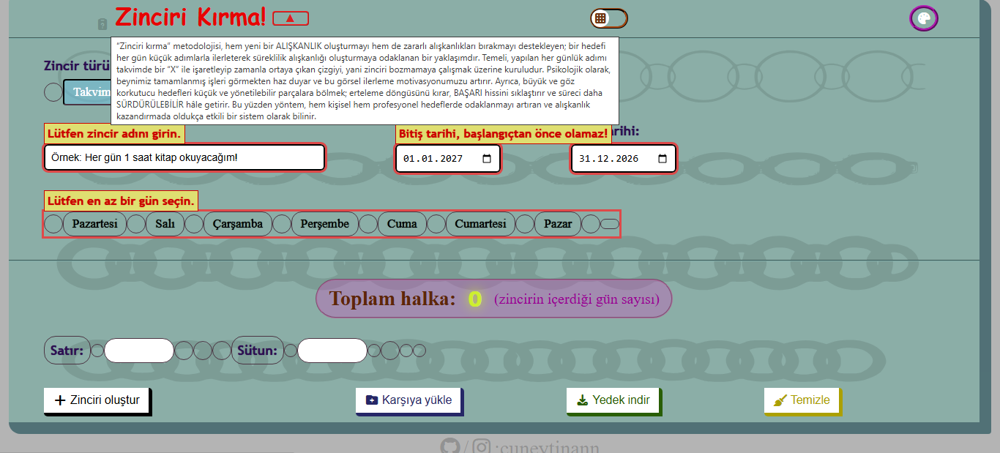
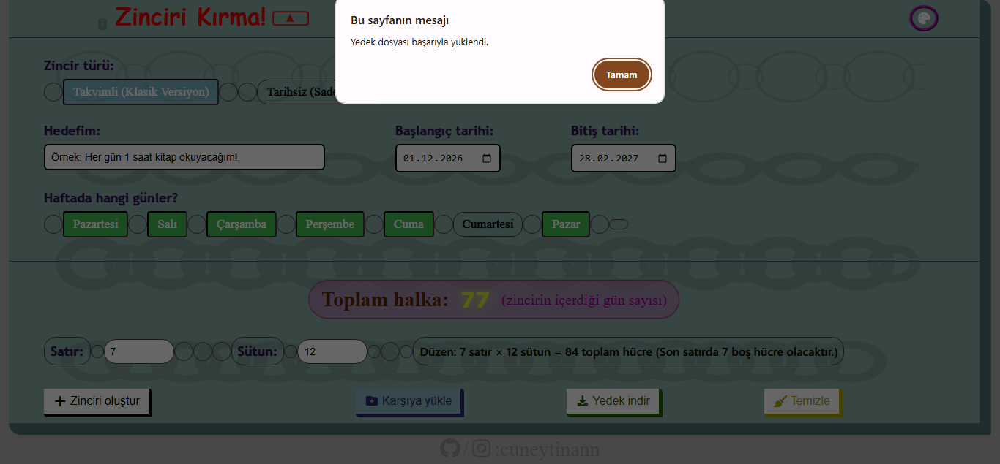

# Zinciri Kırma (Alışkanlık Takip Aracı)

Bu proje, Jerry Seinfeld’in **“Don’t Break the Chain / Zinciri Kırma”** yaklaşımından ilham alan, tarayıcı üzerinde çalışan, çevrimdışı kullanılabilen bir alışkanlık takip aracıdır.

Kod tabanı, anlamlı değişken isimleri ve yerinde kullanılan yorum satırları sayesinde **okunabilirliği yüksek** olacak şekilde tasarlanmıştır; ayrıca parçalı ama aynı zamanda **minimal** mimarisi sayesinde yeni özellik eklemek veya mevcut davranışı değiştirmek oldukça kolaydır.

Uygulama iki temel zincir modunu destekler:

* **Tarihe bağlı zincirler**
* **Sayıya bağlı zincirler**

Yeni sürüm ayrıca yapılandırılmış sekmeler, iyileştirilmiş grid sistemi ve kapsamlı validasyon mekanizmaları içerir.

---

## Arayüz Görselleri

Aşağıdaki görüntüler uygulamanın farklı bölümlerine aittir:

Mobile Cihazlarda: 

---

## 1. Öne Çıkan Değişiklikler

* Sade grid tasarımı
* Tarihli / sayı bazlı iki mod
* Normal tablo / yılan görünümlü (iki farklı render seçeneği)
* Geliştirilmiş validasyon
* Akıllı grid hesaplama
* Mobil uyumlu panel
* Minimal UI

---

## 2. Özellikler

### 2.1. Çevrimdışı kullanım

Tüm veriler tarayıcı `localStorage` içinde saklanır. Yedekleme JSON formatında yapılabilir.

### 2.2. Zincir modları

#### Tarihli Zincir

* Tarih aralığı + seçili günlere göre otomatik hesaplama
* Ay/yıl geçişlerini belirten görsel ayrımlar

#### Sayı Bazlı Zincir

* Toplam halkaya göre kareye yakın grid üretir
* Manuel satır–sütun değişiklikleri en yakın geçerli düzene yuvarlanır

### 2.3. Akıllı Grid Hesaplamaları

* Tarihli modda sütunlar gün sayısına göre hesaplanır
* Sayı modunda en kareye yakın düzen bulunur

### 2.4. X İşaretleri

* Hücreye tıklama ile jitter efektli el yazısı X eklenir
* İkinci tıklamada silinir
* Yedeklerde saklanır

### 2.5. Sekmeli çoklu zincir yönetimi

* Üstte her zincir için sekme
* Zincir silme yalnızca aktif zinciri etkiler

### 2.6 Yılan Modu (Alternatif Görünüm)

* Düz grid yerine **çembersel halkalar** ile daha estetik ve farklı bir görünüm
* Data storage, X işaretleri ve diğer tüm mekanizmalar bu görünümde de aynı şekilde uygulanır.
* Sadece render (görünüm) farklıdır.

### 2.7. JSON Yedekleme

* Tüm zincirleri JSON olarak indirin
* Yedekten yüklemede ID çakışmaları çözülür

---

### 3. Tema, Renk ve Görünüm Sistemi

Uygulama içerisinde arayüzün neredeyse tüm görsel bileşenleri tema sistemi üzerinden yönetilir ve **tema + renk paneli tamamen responsive** olacak şekilde çalışır (mobil / tablet / masaüstü).

#### 3.1. Renk Özelleştirme

* Arka plan, yazılar, hücreler, grid çizgileri ve X işaretleri dahil olmak üzere geniş kapsamlı renk özelleştirme
* Yapılan değişiklikler otomatik olarak **localStorage** üzerinde saklanır
* İstenildiği zaman **varsayılan (default) tema ayarlarına geri dönülebilir**
* Tema ayarları sayfa yenilense dahi korunur

#### 3.2. Hazır Temalar + Özel Tema Üretimi

Uygulama içerisinde 4 adet hazır tema bulunur:

* **Normal**
* **Karanlık**
* **Gece**
* **Matrix**

Bunlara ek olarak kullanıcı;

* İstediği kadar **özel tema (customize)** oluşturabilir,
* Aşırı esnek şekilde özelleştirip kaydedebilir,
* Temalarını kolayca paylaşabilir.
* Tema ayarları da tamamen zincirlerle **aynı mekanima** üzerinden gerçekleşir; ek bir işlem veya zorluk yoktur. Aynı butonlarla aynı JSON dosyasında yedeklenip yüklenebilir.

## 4. Hata ve Validasyon Sistemi

### 4.1. Hata türleri:

* Eksik zincir adı
* Geçersiz tarih aralığı
* Tarihli modda gün seçilmemesi
* Sayı modunda geçersiz toplam değer
* Hatalı JSON dosyası

### 4.2. Otomatik temizleme

* Hata mesajları belirli süre sonra kaybolur
* Glow durumları düzeltildikçe otomatik temizlenir

---

## 5. Kullanım Akışı

1. Mod seçin
2. Zincir adını girin
3. Tarihli modda tarih + gün seçin
4. Sayı modunda toplam halkaları girin
5. Satır–sütun düzenini kontrol edin
6. Zinciri ekleyin
7. Hücreleri X ile işaretleyin
8. Yedek alın veya geri yükleyin

---

## 6. Teknik Mimarinin Özeti

* Tek sayfalık HTML–CSS–JS yapı
* JS tarafında dinamik grid üretimi
* SVG jitter path ile X çizimleri
* Global minimal durum yönetimi
* Modüler ve düzenlenmesi kolay kod yapısı

---

## 7. Number Input Kullanımı (Mobil + Masaüstü)

### Mobilde:

* Sayısal girdi kutularında arttırma ve azaltma okları görünmeyebilir
* Kullanıcı numerik klavyeden değer girer
* Sistem girilen değeri **en yakın geçerli grid değerine** yuvarlar
* Büyük değerlerde grid bozulmaz

### Masaüstünde:

* Artı/eksi okları ile adımlı değişim mümkündür
* Manuel girişlerde otomatik doğrulama aktiftir

---

## 8. Roadmap / Yakında Gelecek Özellikler

### 8.1. Yazdırılabilir Tablo Üretimi (Dijital Olmayan Zincir Kullanımı)

Dijital takipten bağımsız olarak, zincir kırma metodolojisi için
yazdırılabilir, boş ve işaretlenmeye hazır tablolar üretimi.

* Word ve PDF gibi ortamlarda kullanılabilecek **yazıcı uyumlu tablolar**
* Önceden işaretlenmiş hücreler olmadan, **tamamen boş tablo üretimi**
* Zincir mantığına uygun:
  * Satır / sütun sayısı
  * Gün / blok / dönem bazlı yapı
* Tek sayfa veya çok sayfalı tablo düzenleri
* Çıktı öncesinde tüm yapısal ayarların belirlenebilmesi
* HTML üzerinde manuel düzenleme gerektirmeden,
  **doğrudan çıktı almaya odaklı üretim**

> Bu yapı, uygulamanın dijital modlarından bağımsızdır ve
> fiziksel (kağıt) zincir takibi için tasarlanmıştır.

### 8.2. Full English UI Support

* Tüm arayüzün İngilizce çalışmasını sağlayan tam çeviri modu
* Hata mesajları, butonlar, açıklamalar, grid metinleri dahil tüm metin seti
* Dil seçici veya otomatik tarayıcı dil algılama
* Yedekleme dosyalarına dil bilgisi eklenmesi (opsiyonel)

## 9. Kurulum ve Çalıştırma

1. Projeyi indirin veya klonlayın
2. `index.html` dosyasını bir tarayıcıda açın
3. Tüm özellikler çevrimdışı çalışır
4. İsterseniz GitHub Pages, Netlify, Vercel vb. ile yayınlayabilirsiniz
