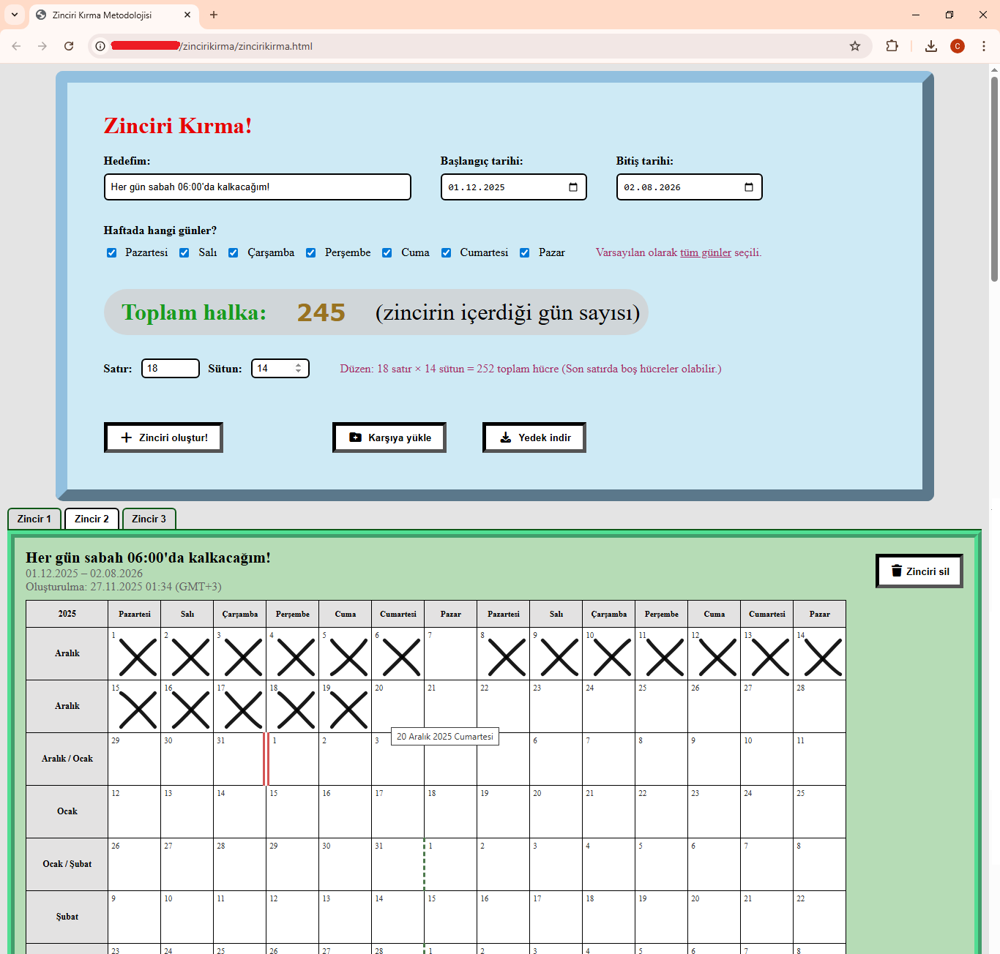

# Zinciri Kırma (Alışkanlık Takip Aracı)

Bu proje, Jerry Seinfeld’in popüler **“Don’t Break the Chain / Zinciri Kırma”** metodundan ilham alan,
tamamen tarayıcı üzerinde çalışan, çevrimdışı kullanılabilen basit bir alışkanlık takip aracıdır.

Belirli bir tarih aralığında ve haftanın seçtiğiniz günlerinde bir zincir (alışkanlık) oluşturur,
günleri tablo şeklinde gösterir ve her tamamlanan gün için hücreye **el yazısı stilinde bir X** atmanızı sağlar.

> **Not:** Arayüz ve bu README şimdilik tamamen **Türkçe**’dir.

---

## Özellikler

- **Çevrimdışı çalışma**  
  Her şey tarayıcı içinde çalışır, sunucuya veri gönderilmez. Veriler `localStorage` ve istersen
  JSON formatlı **`.zincir`** dosyaları ile saklanır ve taşınabilir.

- **Esnek tarih aralığı**  
  Başlangıç ve bitiş tarihini seçerek istediğiniz uzunlukta zincir oluşturabilirsiniz.

- **Haftanın günlerini seçme**  
  Haftanın istediğiniz günlerini kapsayan kendi haftalık periyotunuzu tanımlayabilirsiniz
  (örneğin sadece Pazartesi/Çarşamba/Cuma veya haftanın her günü). Uygulama, seçiminize göre
  zinciri otomatik oluşturur; hiç gün seçmezseniz uyarır, tüm günler seçiliyse bunu ayrıca belirtir.

- **Otomatik halka (gün) hesaplama**  
  Seçilen tarih aralığı + seçilen günlere göre toplam halka (gün) sayısını otomatik hesaplar
  ve ekranda gösterir.

- **Akıllı satır / sütun düzeni (dinamik grid)**  
  - Toplam halka sayısına göre tablo düzeni **otomatik ve mantıklı** bir şekilde hesaplanır.  
  - Seçtiğiniz günlere göre sütun sayısı için mantıklı adımlar belirlenir (örneğin haftada 3 gün
    seçtiysen sütun sayısı 3’ün katları olacak şekilde önerilir).  
  - Satır ve sütun değerlerini manuel değiştirebilirsiniz; uygulama, seçtiğiniz değeri en yakın
    geçerli düzene yuvarlayarak **bozulmayan, tutarlı bir grid** üretir.  
  - Düzen değiştikçe (tarih aralığı veya gün seçimlerini değiştirdiğinizde) satır/sütun aralığı,
    minimum–maksimum değerler ve bilgilendirme metni otomatik güncellenir.

- **El yazısı X işareti**  
  Her hücreye tıklanarak, hafif titreşimli çizgilerle çizilmiş el yazısı hissi veren bir **X**
  işareti eklenir veya kaldırılır. Her X, `localStorage`’a kaydedilir.

- **Ay ve yıl geçişleri için görsel sınırlar**  
  Ay veya yıl değişimlerinde ilgili hücrelerin sol tarafında farklı kenarlık stili ile görsel ayrım yapılır.
  Böylece uzun zincirlerde hangi satırın hangi ay/yıla ait olduğu kolayca seçilir.

- **Birden fazla zincir desteği + sekmeler**  
  Aynı sayfada birden fazla zincir oluşturabilirsiniz. Zincirler,
  üstte **sekme (tab) yapısı** ile listelenir; sekmelerden birini seçtiğinizde o zincirin tablosu
  aktif olarak gösterilir.

- **Zincir oluşturulma zamanı bilgisi**  
  Her zincir oluşturulurken o anki tarih ve saat kaydedilir ve zincir kartında
  “Oluşturulma” bilgisi olarak gösterilir.

- **JSON ile içe/dışa aktarma (.zincir dosyaları)**  
  - Tüm zincirlerinizi JSON formatında **`.zincir`** dosyası olarak indirebilirsiniz.  
  - Daha sonra bu dosyayı tekrar yükleyerek zincirlerinizi geri alabilirsiniz.  
  - Mevcut zincirleriniz silinmez; dışarıdan içe aktardığınız zincirler **var olanların sonuna
    eklenir**. ID çakışmalarında yeni ID üretilerek veri kaybı önlenir.

- **Tablet ve mobil cihazlarla uyumlu (responsive) arayüz**  
  Düzen, küçük ekranlarda (telefon ve tablet) otomatik olarak yeniden yerleşecek şekilde tasarlanmıştır.
  Form alanları, butonlar ve tablo görünümü dar ekranlarda kaydırılabilir ve rahat okunabilir bir
  yapıya dönüşür; masaüstü görünümünü bozmadan mobil deneyimi iyileştirir.

- **Basit, okunabilir ve yoğun yorumlanmış kod yapısı**  
  Uygulama tek bir HTML dosyası içinde, **gömülü CSS ve JavaScript** ile çalışır. Kodun büyük bölümünde
  açıklayıcı yorum satırları bulunur; değişken isimleri ve fonksiyonlar olabildiğince açık seçik tutulmuştur.
  Bu sayede hem arayüzden hem de kaynak koddaki yorumlardan, “hangi değişken ne işe yarıyor / ne oluyor”
  gibi soruların cevabını kolayca takip edebilirsin.

- **Sade ve dikkat dağıtmayan tasarım**  
  Arayüz, zinciri takip etme işine odaklanan sade bir tasarıma sahiptir. Renkler ve kenarlıklar:
  - Tamamlanmış günleri ve tarih aralıklarını net gösterecek kadar belirgin,  
  - Ama göz yormayacak kadar yumuşak seçilmiştir.  
  Böylece uzun süre kullanırken bile dikkatini asıl işten uzaklaştırmadan, alışkanlık takibine
  odaklanabilirsin.

- **Kurulum gerektirmez, tek dosya ile çalışır**  
  Projeyi GitHub Pages, herhangi basit bir statik sunucu veya doğrudan dosyaya çift tıklayarak
  tarayıcıda açabilirsin. Ek bir build adımı, paket yöneticisi veya framework kurulumu gerektirmez.

---

## 📸 Ekran Görüntüsü

Aşağıda uygulamanın örnek görünümü yer almaktadır:

---

## Kullanım (Kısa Özet)

1. **Hedefini gir:**  
   “Hedefim” alanına takip etmek istediğin alışkanlığı yaz (örn. *Her gün 1 saat kitap okuyacağım*).

2. **Tarih aralığını seç:**  
   Başlangıç ve bitiş tarihini belirle.

3. **Haftanın günlerini seç:**  
   Hangi günler için zincir oluşturmak istiyorsan ilgili kutucukları işaretle.

4. **Satır / sütun düzenine göz at:**  
   Aşağıda görünen “Satır / Sütun” alanında önerilen düzeni incele; gerekirse satır veya sütun
   sayısını değiştir. Uygulama, seçimlerini bozmadan en mantıklı düzene yuvarlar.

5. **“Zinciri oluştur!” butonuna bas:**  
   Zincirin oluşturulur ve sekmelerde listelenir.

6. **X işaretlerini ekle:**  
   Her tamamladığın gün için ilgili hücreye tıkla; el yazısı X işaretleri otomatik kaydedilir.

7. **İçe/dışa aktar:**  
   - “Yedek indir” ile `.zincir` dosyası indir.  
   - “Karşıya yükle” ile daha önce kaydettiğin `.zincir` dosyasını ekleyerek zincirlerini geri getir.
